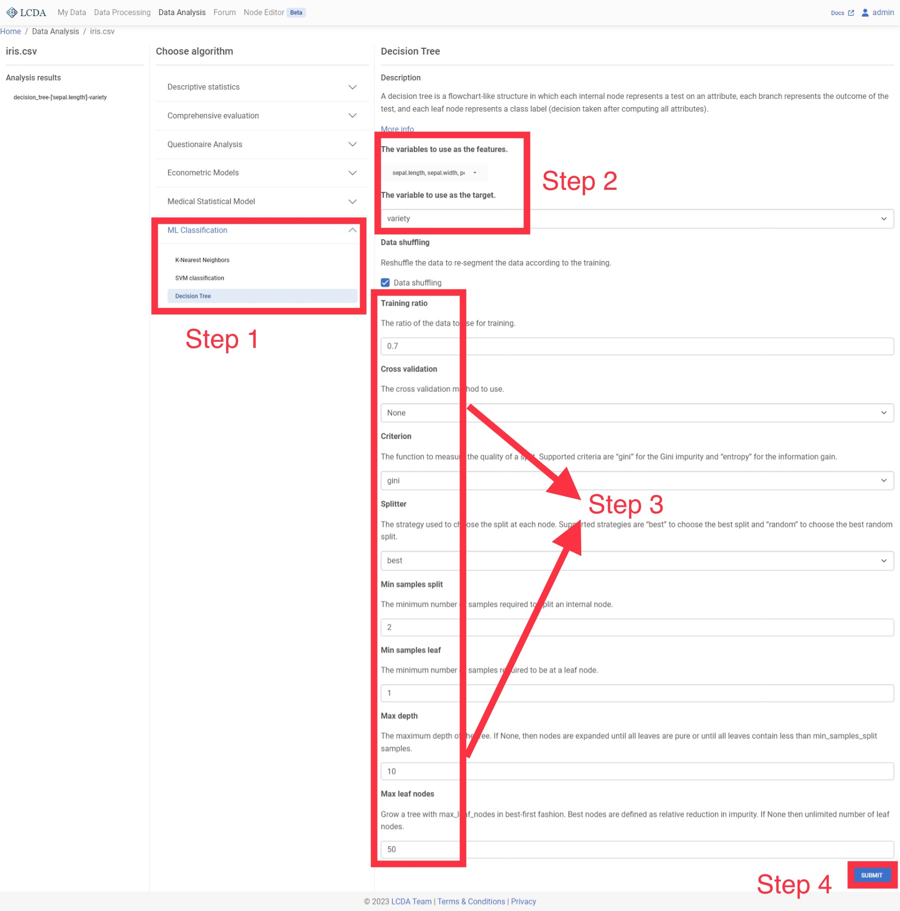
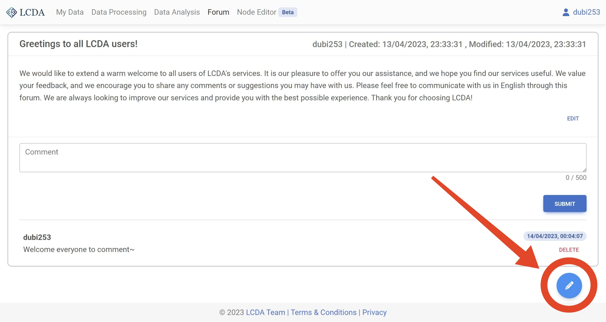

# Low-Code Data Analysis User Manual

**Author: 2022/23-COMP208-Team16**

Haoran Lu, Jiaqi Liao, Jiawei Li, Zhan Jin, Ziqiu Jiang


**Project Website**

[lcda.space](http://lcda.space)

**Online Documentation**

This user manual is also available online at [guide.lcda.space](http://guide.lcda.space).

> As our website is a serverless architecture, this may cause the site to take longer to load.
> We apologise for any inconvenience this may cause you and ask for your patience and understanding.

## Table of Contents

[TOC]


## Introduction

Low-Code Data Analysis (LCDA) is a tool designed to simplify data analysis by minimizing programming requirements. With
LCDA, users can analyze large data sets quickly and easily, without the need for writing complex code. The platform
features a user-friendly interface that enables users to drag and drop data into the analysis and visualization results,
making it an ideal tool for beginners in artificial intelligence, data scientists, business analysts, and anyone seeking
to derive insights from data.

The LCDA platform was developed with the aim of addressing the challenges faced by beginners when dealing with the
complicated terminologies associated with artificial intelligence. The LCDA team, comprised of members who took
an [introductory course in Artificial Intelligence](http://modules.xjtlu.edu.cn/?mod_code=INT104)
during their undergraduate Year 1 studies, understands the difficulty of learning AI from scratch. To make the process
less intimidating for beginners, the team decided to create a website that allows users to explore the world of AI
without having to install any software. Currently, the platform is in the demo stage and is continuously being improved
to provide a better user experience.

### How It Works

LCDA is a Python-based web application that is built using [Flask](https://flask.palletsprojects.com/en/latest/), making
it easily accessible to users through their web browser. Python was chosen as the programming language for this project
due to its extensive library of artificial intelligence and data science related packages. This allowed the team to
efficiently achieve the project's goals within a limited development timeline.

To ensure that users can access the LCDA platform with ease, the team has implemented various security measures. The
platform uses SSL encryption to secure user data during transmission and uses a secure login process to prevent
unauthorized access. Additionally, the platform is regularly updated with the latest security patches to ensure that
users are protected against any potential vulnerabilities.

### Why Not ...?

#### SPSS Statistics

SPSS is a widely used data analysis software with an excellent set of products. While SPSS can perform far more
specialized functions than LCDA, it requires a fee for usage, and its interface can be complex, making it challenging
for beginners to use. In contrast, LCDA prioritizes user-friendly design and intuitive functionality, making it easy for
beginners to get started with data analysis.

#### Python

Python is a popular programming language for artificial intelligence and data science, and its open-source nature makes
it easily accessible. However, for beginners who are unfamiliar with programming, installing and using a large number of
Python AI-related packages can be overwhelming, let alone mastering the use of functions in the library. LCDA is a
Python-based web application that simplifies data analysis by packaging common data analysis algorithms, providing
visualization tools, and offering user-friendly result pages. This reduces the cost of trial and error for beginners and
enables them to learn new concepts through exploration.

Compared to SPSS and Python, LCDA offers an easy-to-use platform that combines the benefits of both. It provides a
low-code solution that simplifies data analysis without sacrificing functionality, making it an ideal choice for
beginners, data scientists, business analysts, and anyone looking to derive insights from data with ease.

## Installation and Deployment Guide

### Before Starting the Installation

The quickest way to use LCDA is to directly visit the [official website of LCDA](https://www.lcda.space/).

However, if you want to deploy your own LCDA, it is essential to ensure that you can create and configure the following
instances: [Google Cloud Run](https://cloud.google.com/run), [Google Cloud Storage](https://cloud.google.com/storage),
and a publicly accessible database such as [Amazon RDS](https://aws.amazon.com/rds/).

Please note that deploying LCDA in the cloud requires a certain level of technical expertise, and it is recommended that
you have experience with cloud services before attempting to deploy LCDA on your own.

### Prerequisites

- [Miniconda](https://docs.conda.io/en/latest/miniconda.html) v23.1.0+
  or [Anaconda](https://www.anaconda.com/products/distribution) v23.1.0+

- [Git](https://git-scm.com/downloads) v2.30+

- [Google Cloud Run](https://cloud.google.com/run)

- [Google Cloud Storage](https://cloud.google.com/storage)

- [Amazon RDS](https://aws.amazon.com/rds/)

### Installation and Deployment Steps

This section will help you step by step from scratch to deploying the LCDA platform.

1. Create and change into a new directory

   ```bash
   mkdir COMP208-202223-Team16
   cd COMP208-202223-Team16
   ```

2. Pull source code

   ```bash
   git clone https://github.com/COMP208-Team-16-2022-23/Group-Project-Code.git
   ```

3. Change into project directory

   ```bash
   cd Group-Project-Code
   ```

4. Create and activate a Python virtual environment

   You can choose either `venv` or `conda` to create a virtual environment.

    You can choose either `venv` or `conda` to create a virtual environment.

    > - `venv` environment is suitable for **short-term testing** and can be deleted along with the project folder without
      affecting the system environment.
    > 
    > - `conda` environment is suitable for **long-term development** as it offers more comprehensive package
      management and environment management functions.

   #### `venv` virtual environment

   This command will create a virtual environment in the current directory.

   ```bash
   python -m venv .
   ```

   Activate the virtual environment

   - Bash:

   ```bash
   source ./bin/activate
   ```

    - CMD:

   ```bash
   .\Scripts\activate.bat
   ```

   Install the required packages

   ```bash
   pip install -r requirements.txt
   ```

   #### `Conda` virtual environment

   Create a Conda virtual environment named `COMP208` with Python version 3.10.

   ```bash
   conda env create -f ./misc/environment.yml
   ```

   Activate Conda virtual environment

   ```bash
   conda activate COMP208
   ```

5. Configuring Google Cloud

   LCDA was originally designed to be deployed in the cloud. Therefore, configuring cloud services is an essential part
   of running LCDA smoothly. For each cloud service configuration tutorial, please refer to its official documentation,
   which will not be repeated in this article.

    - [Amazon RDS](https://aws.amazon.com/rds/): LCDA uses Amazon RDS to host the website database. Detailed database
      configuration tutorials can be found in
      the [official documentation](https://docs.aws.amazon.com/AmazonRDS/latest/UserGuide/Welcome.html). However, users
      can also choose other cloud
      hosting service providers for their
      database needs.

    - [Google Cloud Storage](https://cloud.google.com/storage): LCDA uses Google Cloud Storage as the storage server for
      the website. Detailed tutorials on using Google Cloud Storage can be found in
      the [official documentation](https://cloud.google.com/storage/docs).

    - [Google Cloud Run](https://cloud.google.com/run): LCDA uses Google Cloud Run to host and deploy the website. A
      detailed tutorial on using Google Cloud Run can be found in
      the [official documentation](https://cloud.google.com/run/docs).

   Do not worry, many cloud service providers offer users a certain amount of free trial quota. If LCDA is only used for
   testing, there will be no additional expenses.

6. Configuring `/secret.py`

   Before you can deploy and run LCDA, you need to configure the `/secret.py` file with relevant information. This file
   contains sensitive information such as API keys, database passwords, and other secrets that are required for the
   proper functioning of the application. In this case, it also includes relevant Google Cloud information.

   The following is an example of configuring `/secret.py`:

      ```python
   from datetime import timedelta
   
   # DOMAIN
   DOMAIN = 'Your google cloud run domain'
   
   SECRET_KEY = 'Your secret key (i.e. a random string)'
   PERMANENT_SESSION_LIFETIME = timedelta(minutes=45)
   
   # Configuration for the database
   HOSTNAME = 'Your database hostname'
   PORT = 'Your database port'
   DATABASE = 'Your database name'
   USERNAME = 'Your database account username'
   PASSWORD = 'Your database account password'
   LOCAL_TEST = False  # set to True will ignore the above configuration and use local sqlite database called project.db
   
   # Configuration variables for email
   # configure the mail settings
   MAIL_SERVER = 'Your email server'
   MAIL_PORT = 465 # Your email server port
   MAIL_USE_SSL = True # Whether your email server uses SSL
   MAIL_USERNAME = 'Your email address'
   MAIL_PASSWORD = 'Your email account password' 
   MAIL_DEFAULT_SENDER = 'LCDA Team'
   MAIL_MAX_EMAILS = None
   
   # Configuration variables for Google Cloud Storage
   GOOGLE_APPLICATION_CREDENTIALS = {
       # Your service account key, in json format.
   }
   BUCKET_NAME = 'Your Google Cloud Storage bucket name'
      ```

7. Deploy LCDA locally

    Bash:
    
    ```bash
    export FLASK_APP=app.py
    export FLASK_ENV=development
    flask run
   ```
   
    CMD:
   
    ```bash
    set FLASK_APP=app.py
    set FLASK_ENV=development
    flask run
    ```
   
    PowerShell:
   
    ```bash
    $env:FLASK_APP = "app.py"
    $env:FLASK_ENV = "development"
    flask run
    ```
   

You're done! Now you can visit [http://127.0.0.1:5000](http://127.0.0.1:5000) in your browser to
access LCDA.

## Authentication of Users

User authentication is an important part of our platform. To ensure that no user data is lost, most functions require a
login. By registering, we ensure that your data is kept private and that you give your informed consent to our terms and
policies.

> Note: You may not receive the expected email. If this is the case, please check that your email address is valid and
> check the spam folder of your mailbox. In some cases, you need to contact your email provider.

### Login

To access the platform, users must first authenticate themselves through the login process.


To login, follow these steps:

1. Click on the '[Login](https://www.lcda.space/auth/login)' button or be redirected to the login page.

2. Enter your registered email address and password.

3. Click on the "Sign In" button.
   If the email address and password match what we have on record,
   you will be redirected to 'My Data' page or the page that requires login.

### Registration

To use our platform, you must first register an account.


To register, follow these steps:

1. Click on the '[Sign Up](https://www.lcda.space/auth/register)' button.
2. Enter a valid and unused username, your email address,
   and desired password. The password must be at least 8 characters long and contain at least one uppercase letter, one
   lowercase letter, and one digit.
3. Read the [Terms and Conditions](https://www.lcda.space/legal/terms)
   and [Privacy Policy](https://www.lcda.space/legal/privacy) carefully.
4. Check the "Agree to Terms of Use and Privacy Policy" checkbox.
5. Click on the "Register" button.

Once verified, you will be redirected to the login page. You will also receive a welcome email.

### Password Reset


If you have forgotten your password, follow these steps to reset it:

1. Navigate to the [Account Recovery](https://www.lcda.space/auth/forgot_password) page.
2. Enter the email address associated with your account.
3. Click on the "Next" button.

If the email address is registered, you will receive an OTP (One Time Password) email to the provided email address.


Use the OTP to reset your password by following these steps:

1. Enter the OTP received in your email.
2. Enter your new password as per the requirements listed on the page.
3. Click on the "Reset" button.

If the password reset is successful, you will be redirected to the login page
with a message indicating the success of the password reset.
You will also receive a confirmation email at the same time.

## My Data

My Data manages data files, allowing you to upload, preview and download data. The platform provides public
datasets `iris.csv` and `ProgAssign.csv` for all users.

> The `iris.csv` dataset contains information on 150 iris flowers, including sepal length, sepal width, petal length,
> petal width, and variety. This dataset is sourced from
> the [UCI Machine Learning Repository](https://archive.ics.uci.edu/ml/datasets/iris).
>
> The `ProgAssign.csv` dataset contains 514 student records, including grades for five courses and student programme.
> Please note that the data in the `ProgAssign.csv` dataset content is constructed by the LCDA team and does not represent
> real-world data.

### Upload File

Once logged in, click `Choose File` and select the file you need to upload, or drag the file from the folder into
the `Select File` option box. Click `Upload` after choosing the file, then you can see the files you have uploaded in
the file list below.

- Upload one file once
- Support file format of `.xlsx`, `.xls` and `.csv`
- File size cannot exceed 3MB


### File Actions

In the file list, you can preview, download and delete files.

- View: You can view **any** file in the Excel view on the right
- Download: You can download **any** file locally
- Delete: You can delete **only** files uploaded or created by yourself

> When you use [**Data Processing**](#data-processing), processed files will be created automatically and added to the file list .
> If you try to delete a file involved in a **Data Processing** project, you will receive a warning. You will then be
> able to decide whether or not to proceed with the deletion operation.


## Data Processing

Data processing is a crucial step in analyzing experimental data using LCDA. Data collected from experiments may contain
various issues, such as noise, skewness, and outliers, which may affect the accuracy and reliability of the results.
Therefore, it is important to process the data before analysis.

This chapter will guide you through the steps of data processing. Whether you are a novice or an experienced user, this
chapter provides valuable information and guidance to help you obtain accurate and reliable results using LCDA.

### Data Processing Projects

#### Create a new project

Before beginning data processing in LCDA, you will need to create a new data processing project. This can be done by
clicking on the `NEW PROCESSING` button located in the upper right corner of the `Data Processing` interface.


In the pop-up window, you will need to select a dataset (Want to upload your own dataset? Please refer to the
[My Data](#my-data) user manual to learn how to upload a dataset). Then click on the `START PROCESSING`
button in the lower right corner to start data processing. The system will automatically create a data processing
project for you.

Here we use the `iris.csv` dataset to demonstrate the process of data processing.


#### Continue editing a project

If you have already created a data processing project, the data processing interface will list all of your data
processing projects. You can click on the `EDIT` button on the right to continue editing an existing data processing
project.


#### Delete a project

If you no longer need a data processing project, you can click on the `DELETE` button on the right to delete the
project.

> **Note**: Deleting data processing items is a permanent operation and cannot be recovered after deletion. This also
> deletes the dataset generated by the last run in the project.
> Please make sure you have saved the data you need before deleting the project.


### Data Processing Steps

1. After clicking the `EDIT` button or creating a new data processing project, the data processing interface is
   displayed. From here, you can work with the data.

   

   In the data processing interface, you will find a list of data processing algorithms on the left-hand side. You can
   select the algorithm you want to use by clicking on it, and then set the parameters of the algorithm in the pop-up
   panel. The specific parameters for each algorithm may vary, so please refer to
   the [Data Processing Algorithms](#data-processing-algorithms) for more information on how to set them.

   

2. Here, we will demonstrate the process of using the `Outlier handling` algorithm as an example. Once you have selected
   the algorithm and set the parameters, you can click on the `Start processing` button located in the lower right
   corner of the panel to initiate the algorithm.

   

3. Once the algorithm has completed processing the data, the output will be displayed on the right-hand side of the
   interface.

   

4. At the same time, the processed dataset will be saved and added to your list of datasets. To view or download your
   new dataset, you can navigate to the `My Data` page.

   

### Data Processing Algorithms

#### Outlier Handling

##### Description

Outlier handling algorithms are used to identify and handle outliers in a dataset. In statistics, an outlier is a data
point that significantly differs from other observations, and may be caused by experimental error or other factors.
Outliers can cause serious problems in statistical analysis and can affect the accuracy and reliability of results.
Therefore, outlier handling algorithms are essential for identifying and dealing with these problematic data points.
These algorithms can help improve the quality of the dataset and ultimately lead to more accurate and reliable analysis
results.

> [Outlier - Wikipedia](https://en.wikipedia.org/wiki/Outlier)

##### Parameters

- `Detection method`: Outlier detection method. currently supported
  [3-sigma](https://en.wikipedia.org/wiki/68%E2%80%9395%E2%80%9399.7_rule), [IQR](https://en.wikipedia.org/wiki/Interquartile_range),
  and [MAD](https://en.wikipedia.org/wiki/Median_absolute_deviation) three methods.
- `Processing method`: Outlier processing method. Currently supports `set to null`, `set to mean`, and `set to median`
  three methods.

#### Missing Value Handling

##### Description

Missing data can result in biased or inaccurate results if not handled properly. Missing value handling algorithms can
be used to impute the missing data with reasonable estimates, based on statistical methods such as mean imputation,
median imputation. These methods can help to reduce the bias and improve the accuracy of statistical analysis.

> [Missing data - Wikipedia](https://en.wikipedia.org/wiki/Missing_data)

##### Parameters

- `identification method`: Missing value detection method. Currently supports `empty`, `space`, `None` and `Non-numeric`
  four methods.
- `filling method`: missing value processing method. Currently supports `mean`, `median`, and `mode` three methods.

#### Tail Shrinkage and Truncation Processing

##### Description

Tail shrinkage and truncation processing algorithms are used to shrink the tails of a distribution. This can be useful
when the tails of a distribution are too long, which can cause problems in statistical analysis. These algorithms can
help to reduce the bias and improve the accuracy of statistical analysis.


> [Truncation (statistics) - Wikipedia](https://en.wikipedia.org/wiki/Truncation_(statistics))
>
> [Shrinkage (statistics) - Wikipedia](https://en.wikipedia.org/wiki/Shrinkage_(statistics))

##### Parameters

- `method_selection`: Tail shrinkage and truncation processing method. Currently supports `tail_shrinkage`
  and `tail_truncation` two methods.
- `upper_limit`: Upper limit of the tail shrinkage and truncation processing. Data types are numeric.
- `lower_limit`: Lower limit of the tail shrinkage and truncation processing. Data types are numeric.
- `processing_method`: Tail shrinkage and truncation processing method. Currently supports `delete_value`
  and `delete_row` two methods.

#### Data Transformation

##### Description

In statistics, data transformation is the application of a deterministic mathematical function to each point in a data
set—that is, each data point z is replaced with the transformed value y = f(z), where f is a function. Transforms are
usually applied so that the data appear to more closely meet the assumptions of a statistical inference procedure that
is to be applied, or to improve the interpretability or appearance of graphs.

> [Data transformation (statistics) - Wikipedia](https://en.wikipedia.org/wiki/Data_transformation_(statistics))

##### Parameters

- `transform_method`: Data conversion method. Currently, [FFT](https://en.wikipedia.org/wiki/Fast_Fourier_transform) and
  IFFT (Inverse Fast Fourier Transform) are supported.

#### Dimension Reduction

##### Description

Data dimensionality reduction is the process of reducing the number of dimensions or variables in a high-dimensional
dataset, while retaining the essential information. The aim is to simplify the dataset and eliminate the irrelevant or
redundant variables, making it easier to process and analyze. The process involves transforming the data into a
lower-dimensional space, while still preserving the key characteristics of the data. This technique is particularly
useful for dealing with large datasets where high dimensionality can lead to issues with computational efficiency and
overfitting.

> [Dimensionality reduction - Wikipedia](https://en.wikipedia.org/wiki/Dimensionality_reduction)

##### Parameters

- `method`: Dimensionality reduction method. Currently
  supports [PCA](https://en.wikipedia.org/wiki/Principal_component_analysis)
  and [LDA](https://en.wikipedia.org/wiki/Linear_discriminant_analysis) two methods.
- `n_components`: Number of components to keep. Data types are numeric.

#### Sample Balancing

##### Description

Sample balance refers to the process of adjusting the number of samples in each category of a dataset so that they are
more evenly distributed. This is important in machine learning and statistical analysis because imbalanced datasets can
lead to biased results, especially when dealing with rare events or minority classes. By balancing the samples, we can
improve the performance and accuracy of the algorithms that use the dataset.

> [Oversampling and undersampling in data analysis - Wikipedia](https://en.wikipedia.org/wiki/Oversampling_and_undersampling_in_data_analysis)

##### Parameters

- `balancing_method`: Sample balancing method. Currently
  supports `undersample` ([RandomUnderSampler](https://imbalanced-learn.org/stable/references/generated/imblearn.under_sampling.RandomUnderSampler.html)),
  `oversample` ([RandomOverSampler](https://imbalanced-learn.org/stable/references/generated/imblearn.over_sampling.RandomOverSampler.html))
  and `combined` （[SMOTEENN](https://imbalanced-learn.org/stable/references/generated/imblearn.combine.SMOTEENN.html))
  three methods.

#### Normalization

##### Description

The purpose of standardization is to make the dataset easier to compare and analyze. Standardization also helps to
remove the units of measurement from the data, making it possible to compare variables that have different units.

> [Normalization (statistics) - Wikipedia](https://en.wikipedia.org/wiki/Normalization_(statistics))

##### Parameters

- `Method`: Normalization method. Currently supports [Min_Max](https://en.wikipedia.org/wiki/Feature_scaling) and
  [Z_Score](https://en.wikipedia.org/wiki/Standard_score) two methods.

## Data Analysis

Data Analysis helps you to analyze your data on top of [Data Processing](#data-processing). Data Analysis provides
various algorithms and models used in economics, medicine, social science and Machine Learning, etc.

This chapter will tell you how to analyze data with LCDA, with all the information about the algorithms we provide.

### Analysis Steps

1. Click on `Data Analysis` in the navigation bar above to go to the data analysis page.

2. Once logged in, click on `NEW ANALYSIS` in the top right corner, here we select the dataset `iris.csv` and click
   on `START ANALYSING` to start the analysis of the data.
   
   

3. The project page firstly displays the project's analysis results `Analysis results` and the algorithm selection
   area `Choose algorithm`.

   

   In the algorithm selection area, the data analysis algorithms and models are classified into several categories. Here
   we will apply the KNN classification algorithm to the iris dataset, so we click on `ML Classification` and
   select `K-Nearest Neighbors`. A description of the algorithm, the available parameters and the corresponding
   description will be displayed on the right.
   
   Once you have configured the parameters, click `SUBMIT` in the bottom right corner at the end of the page to submit
   the algorithm and parameters.

4. Once you have submitted your algorithm, you can see the analysis report for the algorithm you have just run in
   the `Analysis results` on the left hand side. Click on the report to view it on the right.
   

5. The `Print` button on the top right of the report provides a full screen view and download of the report.

### Algorithms

#### Comprehensive Evaluation

##### Decision Matrix

Decision matrix (or CRITIC weighting method) is an objective weighting method. The idea is to use two indicators, which are contrast intensity and conflictiveness. Contrast intensity is expressed by standard deviation, if the standard deviation of the data is larger, it means more fluctuation, and the weight will be higher; conflict is expressed by correlation coefficient, if the value of correlation coefficient between indicators is larger, it means less conflict, and then its weight will be lower. For the comprehensive evaluation of multiple indicators and multiple objects, decision matrix eliminates the influence of some indicators with strong correlation and reduces the overlap of information between indicators, which is more conducive to obtaining credible evaluation results.

###### Input and Output

- Input: at least two or more quantitative variables (can be positive or negative, but do not standardize)

- Output: Enter the values of the weights corresponding to the quantitative variables


###### Example Case


#### Descriptive Statistics

##### Normality Test

A normality test is any statistical test for determining whether a data sample comes from a normal distribution.

###### Input and Output

- Input: One or more quantitative variables
- Output: The results of the model test (with data satisfying/not satisfying a normal distribution)

###### Example Case

 


#### Questionnaire Analysis

##### Reliability Analysis

Reliability analysis is mainly used to examine the stability and consistency of the results measured by the scale in the
questionnaire, that is, to test whether the scale samples in the questionnaire are reliable and credible. The scale
question type is the option of the question, which is set according to the level of statement. For example, our love for
mobile phones has changed from very fond of to dislike. The most famous scale in the scale is the Likert 5-level scale.
The options of this scale are mainly divided into "strongly agree", "agree", "not sure", "disagree", "very disagree"
five answers, recorded as 5, 4, 3, 2, 1 respectively.

###### Input and Output

- Input: At least two or more quantitative variables or ordered fixed categories of variables, generally requiring data
  to be scale data
- Output: Reliability of the reliability of the collection questionnaire scales

###### Example Case


#### Econometric Models

##### ADF Test

When using many time series models, such as ARMA and ARIMA, the time series is required to be stationary, so generally
when studying a period of time series, the first step is to perform a stationarity test. In addition to the method of
visual inspection, in addition The more commonly used strict statistical test method is the ADF test, also known as the
unit root test.

###### Input and Output

- Input: 1 quantitative variable for time series data
- Output: Sequence data is smoothed at several orders of differencing

###### Example Case


#### Medical Statistical Model

##### Bland-Altman Method

A method for visual consistency checking. Its principle is an intuitive method to draw graphs using the difference, mean
and 95% consistency (LoA) of the results of the two methods, so as to determine whether the results of the two methods
are consistent.

###### Input and Output

- Input: Two quantitative variables representing the two methods
- Output: Bland-Altman graph and whether there is consistency in the approach.

###### Example Case   


#### ML Classification

##### K-Nearest Neighbors

K-Nearest Neighbors is a simple algorithm that stores all available cases and classifies new cases based on a similarity
measure (e.g., distance functions).

###### Input and Output

- Input: The variables as features are fixed or quantitative variables, and the variable as target is a fixed
  variable. <!--content here need check-->
- Output: The classification results of the model and the evaluation effect of the model classification.

###### Parameter Options

  - Data Shuffling: Whether to shuffle data randomly
  - Training Ratio: Ratio of training data to the whole dataset
  - Cross Validation:  The number of equal sized subsamples randomly partitioned from the original sample. Each subsample will be retained as the validation data for testing the model, and the remaining subsamples will be used as training data
  - Number of Neighbors: Number of neighbors to use
  - Weights: Weight function used in prediction. Selection values: 
    - uniform: Uniform weights. All points in each neighborhood are weighted equally
    - distance: Weight points by the inverse of their distance. in this case, closer neighbors of a query point will have a greater influence than neighbors which are further away
  - Algorithm: Algorithm used to compute the nearest neighbors. Selection values: 
    - auto: will attempt to decide the most appropriate algorithm based on the values passed
    - ball_tree: will use [`BallTree`](https://en.wikipedia.org/wiki/Ball_tree)
    - kd_tree: will use [`KDTree`]([k-d tree - Wikipedia](https://en.wikipedia.org/wiki/K-d_tree)) 
    - brute: will use a brute-force search Note: fitting on sparse input will override the setting of this parameter, using brute force
  - Leaf Size: Leaf size passed to `BallTree` or `KDTree`. This can affect the speed of the construction and query, as well as the memory required to store the tree. The optimal value depends on the nature of the problem
  - P: Power parameter for the Minkowski metric. When p = 1, this is equivalent to using manhattan_distance (l1), and euclidean_distance (l2) for p = 2. For arbitrary p, minkowski_distance (l_p) is used

###### Example Case   


##### SVM classification

Support vector machine (SVM) is a class of generalised linear classifiers that perform binary classification of data in
a supervised learning fashion, with a decision boundary that is a maximum margin hyperplane solved for the learned
samples.

###### Input and Output

- Input: The variables as features are fixed or quantitative variables, and the variable as target is a fixed variable.
- Output: The classification results of the model and the evaluation effect of the model classification.

###### Parameter Options

  - Data Shuffling: Whether to shuffle data randomly
  - Training Ratio: Ratio of training data to the whole dataset
  - Cross Validation:  The number of equal sized subsamples randomly partitioned from the original sample. Each subsample will be retained as the validation data for testing the model, and the remaining subsamples will be used as training data
  - Penalty Coefficient: Regularization parameter. The strength of the regularization is inversely proportional to C. Must be strictly positive. The penalty is a squared l2 penalty
  - Kernel Algorithm: Specifies the kernel type to be used in the algorithm
  - Error Convergence Conditions: Tolerance for stopping criterion
  - Maximum Number of Iterations: Hard limit on iterations within solver, or -1 for no limit

###### Example Case


#### Decision Tree

A decision tree is a flowchart-like structure in which each internal node represents a test on an attribute, each branch represents the outcome of the test, and each leaf node represents a class label (decision taken after computing all attributes).

##### Input and Output

- Input: The variables as features are fixed or quantitative variables, and the variable as target is a fixed variable.
- Output: The classification results of the model and the evaluation effect of the model classification.

##### Parameter Options

  - Data Shuffling: Whether to shuffle data randomly
  - Training Ratio: Ratio of training data to the whole dataset
  - Cross Validation:  The number of equal sized subsamples randomly partitioned from the original sample. Each subsample will be retained as the validation data for testing the model, and the remaining subsamples will be used as training data
  - Criterion: The function to measure the quality of a split. Supported criteria are:
    - gini: for the Gini impurity 
    - entropy: for the Shannon information gain
  - Splitter: The strategy used to choose the split at each node. Supported strategies:
    - best: choose the best split
    - random: choose the best random split
  - Min Samples Split: The minimum number of samples required to split an internal node: 
    - If int, then consider `Min Samples Split` as the minimum number.
    - If float, then `Min Samples Split` is a fraction and `ceil(Min Samples Split * n_samples)` are the minimum number of samples for each split.
  - Min Samples Leaf: The minimum number of samples required to be at a leaf node. A split point at any depth will only be considered if it leaves at least `Min Samples Leaf` training samples in each of the left and right branches. This may have the effect of smoothing the model, especially in regression. 
    - If int, then consider `Min Samples Leaf` as the minimum number.
    - If float, then `Min Samples Leaf` is a fraction and `ceil(Min Samples Leaf* n_samples)` are the minimum number of samples for each node. .. versionchanged:: 0.18 Added float values for fractions.
  - Max Depth: The maximum depth of the tree. If None, then nodes are expanded until all leaves are pure or until all leaves contain less than `Min Samples Split` samples.
  - Max leaf nodes: Grow a tree with `Max leaf nodes` in best-first fashion. Best nodes are defined as relative reduction in impurity. If None then unlimited number of leaf nodes.

##### Example Case




## Forum

The LCDA forum is a platform designed to promote user-friendly communication. Users are encouraged to post questions and
comments, which can be answered and discussed by other users.

If you have any questions or suggestions about LCDA, please feel free to post them in the forum. However, to ensure
effective communication, all posts and comments must be written in English.

To maintain a positive and respectful atmosphere in the forum, please refrain from posting the following types of
content:

- Non-English content.
- Meaningless content, such as random characters or single words or phrases.

LCDA reserves the right to review all content posted in the forum. If any content is found to be in violation of the
[LCDA Terms & Conditions](https://www.lcda.space/legal/terms#ugc), LCDA reserves the right to delete the
content without prior notice.

### Interface

When you visit a forum page, you can view all posts and their corresponding comments. Each post has a title, author,
release time, modification time, and content. You can also see the comments of each post.

Posts and comments are sorted from newest to oldest based on modification time and creation time respectively.

If a post or comment has been modified after it was initially created, its modification time will also be updated.


### Post

After logging in, you can create a new post by clicking the "New Post" button located at the bottom right corner of the
forum page.



This will redirect you to a page where you can fill in the title and text of your post. Once you are done,
simply click on the `SUBMIT` button to publish your post.


### Comment

After logging in, you can write comments below the body of all posts on the main forum page. To do so, simply enter your
comment in the provided text box. Once you have finished writing your comment,click the `SUBMIT` button to post it.

**Please note that comments can only be added below the body of the post, and cannot be added below another comment.
Additionally, once a comment is published, it cannot be edited.**


### Edit Post

When you are logged in, you can edit your own posts on the main forum page by clicking the `EDIT` button to the right of
the post. This will allow you to modify the title and body of the post.


On the page for editing a post, you can modify the title and text of the post. Once you have made the desired changes,
click the `SUBMIT` button to update the post. Alternatively, you can click the `DELETE` button to remove the post.

**It is important to note that deleting a post is an irreversible action, and you will not be able to recover a deleted
post.
Additionally, once a post is deleted, all comments associated with the post will also be removed.**


### Delete Comment

When you are logged in, a `DELETE` button will appear to the right of each comment that you have posted on the main
forum page. Clicking on the `DELETE` button will allow you to delete the comment.

**Please note that once you delete a comment, you will not be able to restore the deleted comment.**


### Violations

Below are some examples of posts that violate the forum rules. If you come across any such content, please report it
to the LCDA team at [lcda.team.2023@gmail.com](mailto:lcda.team.2023@gmail.com) immediately.

#### Non-English Content


#### Meaningless Content


#### Unfriendly Content

Test content:


Filtered content:


## Node Editor

Node Editor is a fully graphical data processing tool. Here you can apply multiple data processing methods to multiple
datasets on a single page at the same time.

### How to Use

1. Once logged in, click on **Node Editor** from the top navigation bar to access the node editor
   interface.<!--can add link-->

2. Right-click on any blank space to call out a list of nodes and left-click on the node name to create the node.

    
    
    

   The nodes to create can be divided functionally into three categories: data nodes, processing nodes and output nodes.
   For a more detailed description of the nodes see [List of Nodes](#list-of-nodes).

3. When establishing a processing flow, there are several points to note:

    - The input interface of each node is on the left, and the output interface is on the right

    - One **input** interface can only be connected to **one** node, but one output interface can be connected to
      multiple nodes, which means that branches can exist in a flow
    - At least one output node must be included in a flow to activate it. Otherwise, the flow will not run

    Next, we will use a Data Node, a Column Selection Node, a Normalization Node, and an End Process Node to build a simple
    data processing flow

    

    Next, we will connect the four nodes in series to activate them all, and select the iris.csv dataset from the public
    dataset for processing in node Data. It can be seen that the column names of iris.csv have been displayed in the
    ColumnSelectionNode

    

    In the ColumnSelectionNode, we fill in `sepal.length`, select the normalization method as Min-Max in the Normalization
    Node, set the new filename as `sepal.length-minmax,` and finally connect Data and Normalization to complete the
    processing flow.

    The processing result will be uploaded to your file space as `sepal.length-minmax.csv`, which can be viewed in `My
    Data`.

    

### List of Nodes

#### Data Nodes

- Data Node

  The Data Node provides the data source for processing in the editor. A drop-down option it has will display the
  datasets you currently have, including those you have uploaded and those generated by processing tasks.

- Column Selection Node

  The Column Selection Node is used to select columns from a dataset. When the Column Selection Node is correctly
  activated in the node editor, a line of text will appear between the input and output interfaces, showing all the
  columns in the received dataset. The input field below the display row is used to select the columns you want to
  output for processing, and column names are separated by commas.

#### Output Nodes

An output node is a node that only has an input interface but no output interface. In the node editor, a process 
**must** contain **at least one** output node to activate the process. 
Otherwise, **any** calculations or operations in the flow will not be effective.

- End Node

  The End Node is the most basic output node, it is also the most recommended one. It does not have any output display,
  but only marks the end of a branch in the process.

- Display Node

  By connecting a node to the Display Node on the basis of the End Node, the output of the current node can be
  displayed. The storage structure of most node output files in the editor can be used to check whether a branch in the
  process has run successfully. However, it is not recommended to use only the Display Node without the End Node.

> Tips:
>
> We do not recommend using Display Node alone because its display is not synchronous. If you use Display Node instead
> of
> End Node alone, but do not see any display content after connection, it does not necessarily mean that the operation in
> the current process or branch has failed. If you have done the above operation, you need to create a new node in the
> node editor to refresh the display.

#### Processing Nodes

The current Node Editor contains 7 processing nodes, which have the same processing methods as those in Data Processing,
and each node is named after a data processing method. Each processing node will include:

- A data input interface, to connect Data Node for input dataset
- A column input interface, to connect Column Selection Node for input columns to process
- A text input, to define name of processed dataset (No extension names needed)
- A output interface, to output processed dataset
- Some parameter options to select for the processing algorithm
