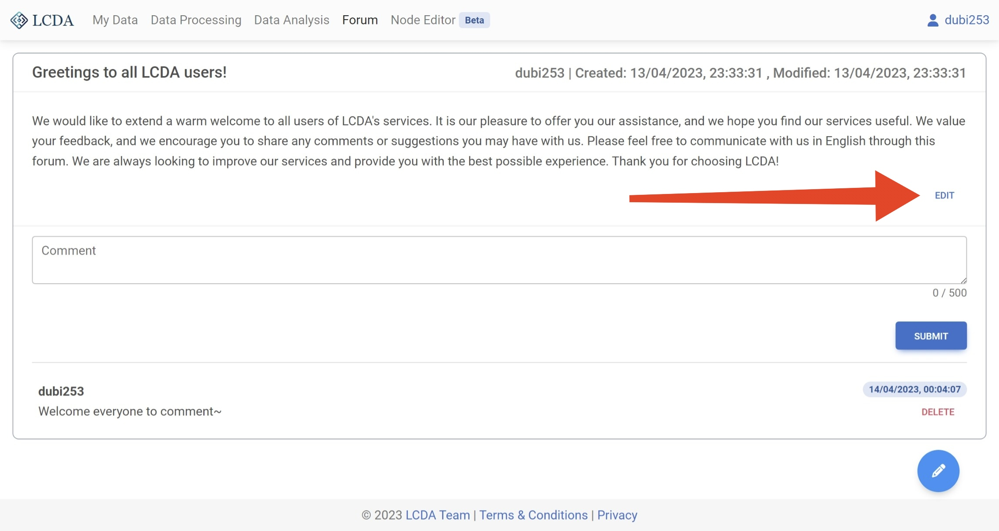
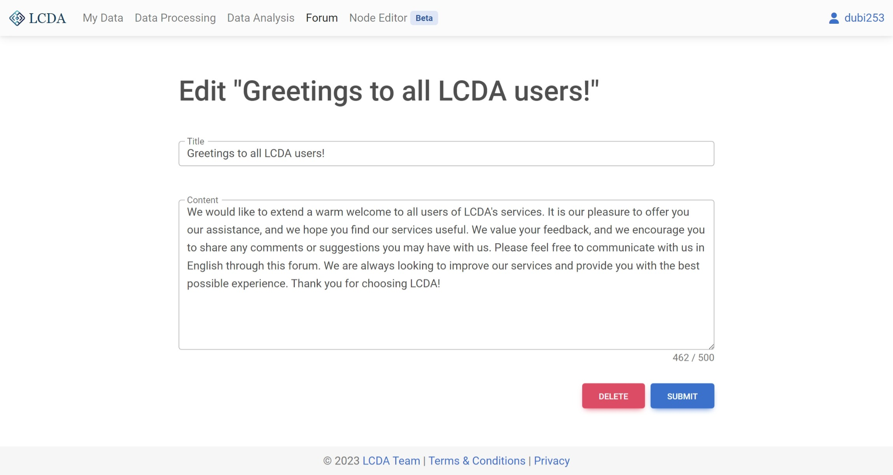
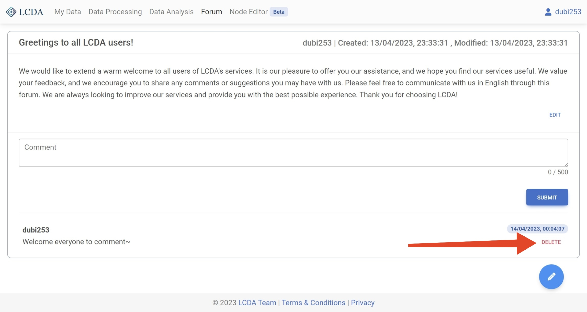
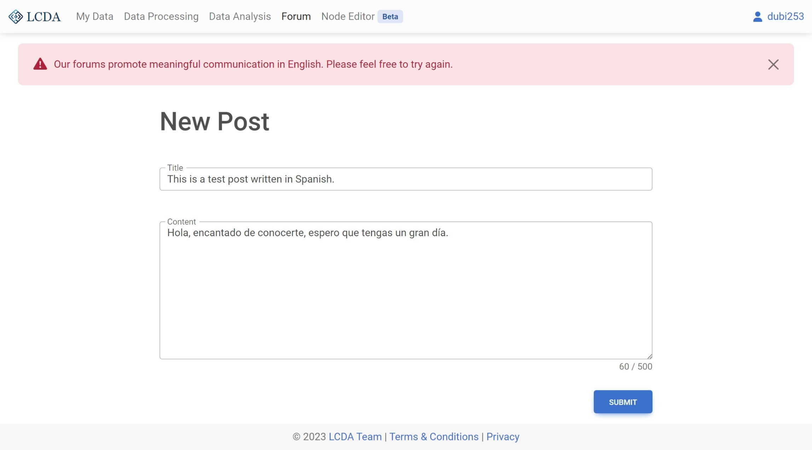

# Forum

The LCDA forum is a platform designed to promote user-friendly communication. Users are encouraged to post questions and
comments, which can be answered and discussed by other users.

If you have any questions or suggestions about LCDA, please feel free to post them in the forum. However, to ensure
effective communication, all posts and comments must be written in English.

To maintain a positive and respectful atmosphere in the forum, please refrain from posting the following types of
content:

- Non-English content.
- Meaningless content, such as random characters or single words or phrases.

LCDA reserves the right to review all content posted in the forum. If any content is found to be in violation of the
[LCDA Terms & Conditions](https://www.lcda.space/legal/terms#ugc), LCDA reserves the right to delete the
content without prior notice.

## Interface

When you visit a forum page, you can view all posts and their corresponding comments. Each post has a title, author,
release time, modification time, and content. You can also see the comments of each post.

Posts and comments are sorted from newest to oldest based on modification time and creation time respectively.

If a post or comment has been modified after it was initially created, its modification time will also be updated.

## Post

After logging in, you can create a new post by clicking the "New Post" button located at the bottom right corner of the
forum page.

This will redirect you to a page where you can fill in the title and text of your post. Once you are done,
simply click on the `SUBMIT` button to publish your post.

## Comment

After logging in, you can write comments below the body of all posts on the main forum page. To do so, simply enter your
comment in the provided text box. Once you have finished writing your comment,click the `SUBMIT` button to post it.

::: tip
Comments can only be added below the body of the post, and cannot be added below another comment.
Additionally, once a comment is published, it cannot be edited.
:::

## Edit Post

When you are logged in, you can edit your own posts on the main forum page by clicking the `EDIT` button to the right of
the post. This will allow you to modify the title and body of the post.

On the page for editing a post, you can modify the title and text of the post. Once you have made the desired changes,
click the `SUBMIT` button to update the post. Alternatively, you can click the `DELETE` button to remove the post.

::: warning
Deleting a post is an irreversible action, and you will not be able to recover a deleted
post. Additionally, once a post is deleted, all comments associated with the post will also be removed.
:::

## Delete Comment

When you are logged in, a `DELETE` button will appear to the right of each comment that you have posted on the main
forum page. Clicking on the `DELETE` button will allow you to delete the comment.

::: warning
Once you delete a comment, you will not be able to restore the deleted comment.
:::

## Violations

Below are some examples of posts that violate the forum rules. If you come across any such content, please report it
to the LCDA team at [lcda.team.2023@gmail.com](mailto:lcda.team.2023@gmail.com) immediately.

### Non-English Content

### Meaningless Content

### Profanity Content

Test content:

Filtered content:

