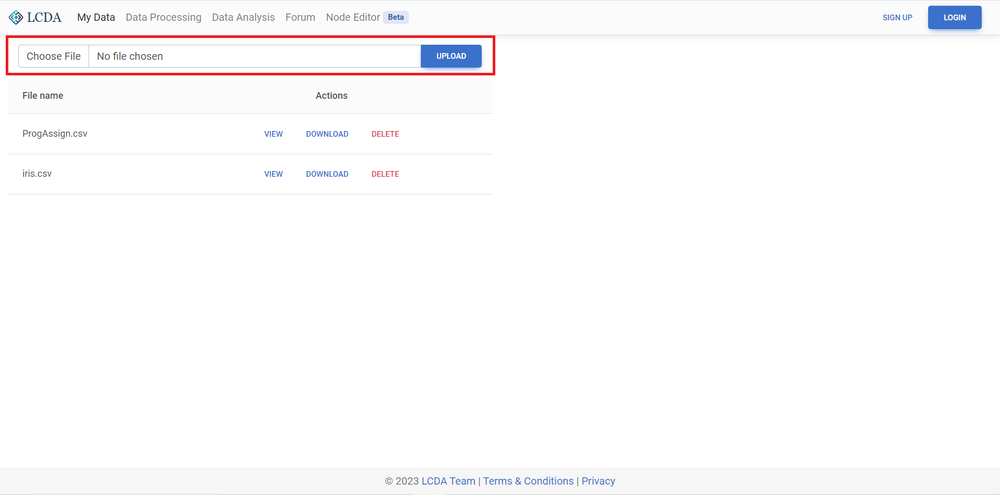

# My Data

My Data manages data files, allowing you to upload, preview and download data. The platform provides public
datasets `ProgAssign.csv`, `iris.csv` and `wine.csv` for all users. You can also upload your own data files.

::: tip
The `ProgAssign.csv` dataset contains 514 student records, including grades for five courses and student programme.
Please note that the data in the `ProgAssign.csv` dataset content is constructed by the LCDA team and does not represent
real-world data.

The `iris.csv` dataset contains information on 150 iris flowers, including sepal length, sepal width, petal length,
petal width, and variety. 

The `wine.csv` dataset contains information on 178 wine samples, including alcohol, malic acid, ash, alcalinity of ash,
magnesium, total phenols, flavanoids, nonflavanoid phenols, proanthocyanins, color intensity, hue, OD280/OD315 of
diluted wines, and proline.
 
The `iris.csv` and `wine.csv` datasets are sourced from the [UCI Machine Learning Repository](https://archive.ics.uci.edu/ml/index.php).
:::

## Upload File

Once logged in, click `Choose File` and select the file you need to upload, or drag the file from the folder into
the `Select File` option box. Click `Upload` after choosing the file, then you can see the files you have uploaded in
the file list below.

- Upload one file once
- Support file format of `.xlsx`, `.xls` and `.csv`
- File size cannot exceed 3MB

## File Actions

In the file list, you can preview, download and delete files.

- View: You can view **any** file in the Excel view on the right
- Download: You can download **any** file locally
- Delete: You can delete **only** files uploaded or created by yourself

::: tip
When you use [Data Processing](./data-processing.md), processed files will be created automatically and added to the file list .
If you try to delete a file involved in a **Data Processing** project, you will receive a warning. You will then be
able to decide whether or not to proceed with the deletion operation.
:::

