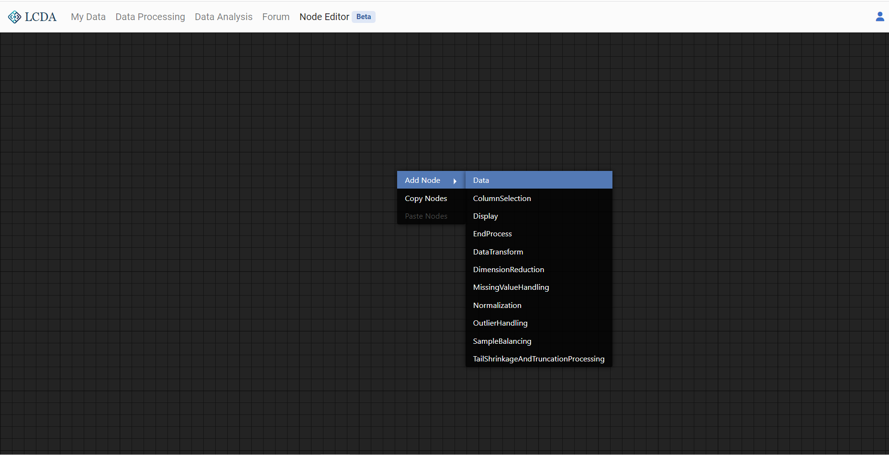

# Node Editor

Node Editor is a fully graphical data processing tool. Here you can apply multiple data processing methods to multiple datasets on a single page at the same time.

## How to use

1. Once logged in, click on **Node Editor** from the top navigation bar to access the node editor interface.<!--can add link-->

2. Right-click on any blank space to call out a list of nodes and left-click on the node name to create the node.

The nodes to create can be divided functionally into three categories: data nodes, processing nodes and output nodes. For a more detailed description of the nodes see [List of Nodes](#list-of-nodes).

3. When establishing a processing flow, there are several points to note:

   - The input interface of each node is on the left, and the output interface is on the right

   - One **input** interface can only be connected to **one** node, but one output interface can be connected to multiple nodes, which means that branches can exist in a flow
   - At least one output node must be included in a flow to activate it. Otherwise, the flow will not run

Next, we will use a Data Node, a Column Selection Node, a Normalization Node, and an End Process Node to build a simple data processing flow

​		

Next, we will connect the four nodes in series to activate them all, and select the iris.csv dataset from the public dataset for processing in node Data. It can be seen that the column names of iris.csv have been displayed in the ColumnSelectionNode

In the ColumnSelectionNode, we fill in 'sepal.length,' select the normalization method as Min-Max in the Normalization Node, set the new filename as 'sepal.length-minmax,' and finally connect Data and Normalization to complete the processing flow. 

The processing result will be uploaded to your file space as 'sepal.length-minmax.csv,' which can be viewed in 'My Data'.

## List of Nodes

### Data Nodes

- Data Node
  
  The Data Node provides the data source for processing in the editor. A drop-down option it has will display the datasets you currently have, including those you have uploaded and those generated by processing tasks.

- Column Selection Node

  The Column Selection Node is used to select columns from a dataset. When the Column Selection Node is correctly activated in the node editor, a line of text will appear between the input and output interfaces, showing all the columns in the received dataset. The input field below the display row is used to select the columns you want to output for processing, and column names are separated by commas.

### Output Nodes

An output node is a node that only has an input interface but no output interface. In the node editor, a process **must** contain **at least one** output node to activate the process. Otherwise, **any** calculations or operations in the flow will not be effective.

- End Node

  The End Node is the most basic output node, it is also the most recommended one. It does not have any output display, but only marks the end of a branch in the process. 

- Display Node

  By connecting a node to the Display Node on the basis of the End Node, the output of the current node can be displayed. The storage structure of most node output files in the editor can be used to check whether a branch in the process has run successfully. However, it is not recommended to use only the Display Node without the End Node.

::: tip

We do not recommend using Display Node alone because its display is not synchronous. If you use Display Node instead of End Node alone, but do not see any display content after connection, it does not necessarily mean that the operation in the current process or branch has failed. If you have done the above operation, you need to create a new node in the node editor to refresh the display.

:::

### Processing Nodes

The current Node Editor contains 7 processing nodes, which have the same processing methods as those in Data Processing, and each node is named after a data processing method. Each processing node will include:

- A data input interface, to connect Data Node for input dataset
- A column input interface, to connect Column Selection Node for input columns to process
- A text input, to define name of processed dataset (No extension names needed)
- A output interface, to output processed dataset
- Some parameter options to select for the processing algorithm

